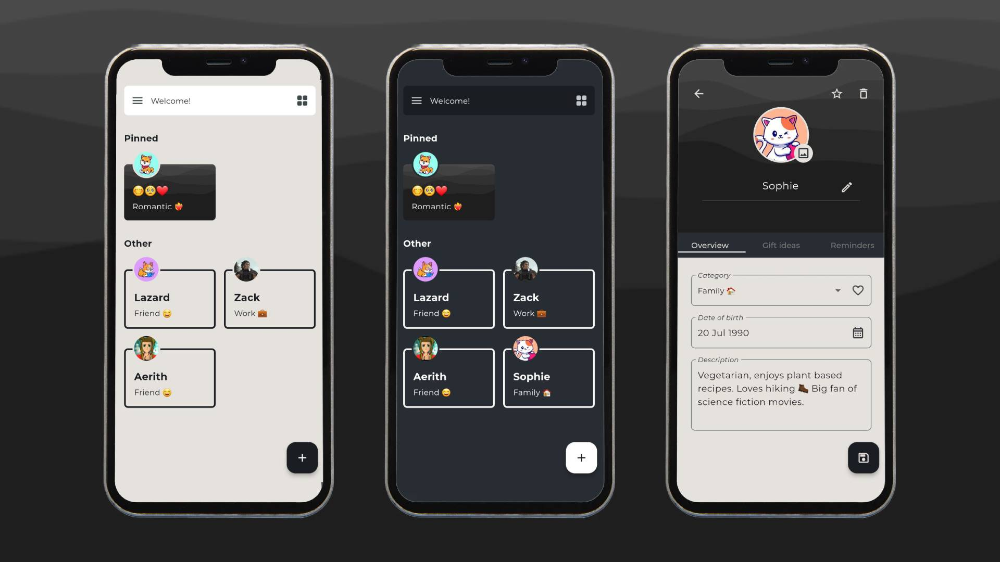

# Inscribe - Companion Journal

### [🥳 Available on Play Store!](https://play.google.com/store/apps/details?id=com.tarapogancev.inscribe)

Inscribe is a **Flutter** mobile application designed for taking notes based on timely friend lexicons. It helps you keep track of important upcoming events, memorable facts, and gift ideas year-round, especially as birthdays approach.

Developed as a Flutter learning project, Inscribe tackles complex concepts and aims to be personally useful, reducing the need for multiple Google Calendar reminders and separate notes. The app adheres to **Clean Architecture Design** and employs **BLOC** for state management, utilizing both Blocs and Cubits for learning purposes, and incorporating the UseCase approach where applicable.

# 🌎 Supported Languages
- 🇬🇧 English
- 🇩🇪 German
- 🇹🇷 Turkish
- 🇫🇷 French
- 🇪🇸 Spanish
- 🇷🇸 Serbian
- 🇷🇺 Russian
- 🇮🇹 Italian

# 🧠 Planned upcoming features
- [x] So many great ideas...

- [ ] Showing age and birthday on the cards on home screen
- [ ] Gift ideas should be a list, not just a plain text field

## 🐞 Known bugs
- [x] Bugs will appear here...

- [ ] Infinite scroll on grid view when there are many cards
- [ ] Add bottom padding on home
- [ ] Birthdays in calendar not loading when changing months forwards-backwards
- [x] Gift ideas panel not including enter on keyboard
- [ ] Visual bug with adding new reminders, dialog changes size when text field expands

#### Main libraries and practices
Clean Architecture, BLOC, cubits, usecases, Hive, freezed, shared preferences, i18n + slang, getIt for DI, adaptive theme, awesome notifications.

### Features
Creating and editing notes, custom images from photos galery, one-time and annual reminders, birthday notifications, archive for temporary deleted notes, multiple languages, dark theme, import and export of data from/to files, calendar screen, hand-drawn illustrations, and many more! :)

# 🖼 Screenshots

# 📚 Resources
[https://www.freepik.com/](https://www.freepik.com/) - Illustrations

[Figma SVG Asset Pack](https://www.figma.com/file/qJfFm08K6qeLqT8enQNVer/Vector-Library---SVG-Assets-Pack-(Community)?type=design&mode=design&t=eGPguRAznDmO61Ju-0) - Wave SVGs

# 💻 Development Commands

Generate translations: `dart run slang`

Run freezed: `dart run build_runner build`

Generate icons: `flutter pub run flutter_launcher_icons`

Rename app: `rename setAppName --targets ios,android,web --value "Inscribe"`